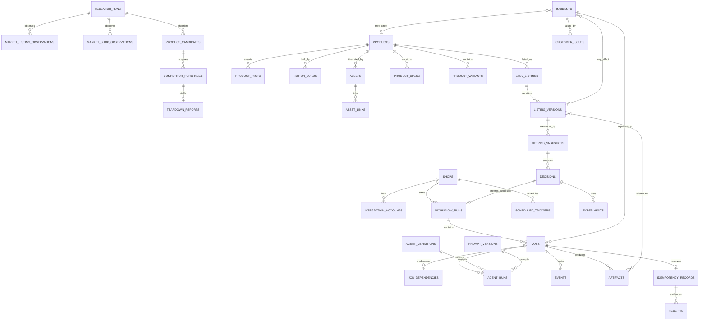

# Data Model

**Contract status:** implemented in Session 02. The schema lives in `src/money_machine/persistence/tables.py` with one Alembic revision under `migrations/versions/`; `tests/unit/test_schema_manifest.py` and `tests/integration/test_migrations.py` assert that the migrated database equals this model exactly, in both directions.

## Identity and time conventions

- Primary identifiers are UUIDs, generated in Python for ORM inserts and by `gen_random_uuid()` for direct SQL, so neither path can create a row without an identity.
- Durable records include timezone-aware `created_at` and `updated_at` timestamps in UTC.
- Mutable aggregates use optimistic version numbers where concurrent operator/provider updates are possible.
- Provider identifiers are scoped by integration account and never used as internal primary keys.
- JSONB is reserved for versioned contract payloads and provider-safe metadata; query-critical state remains typed columns.
- Secrets, cookies, full provider payloads, customer content, and runtime evidence are not stored in ordinary domain rows or committed files.

## Entity groups

| Group | Entities | Ownership and key relationships |
|---|---|---|
| Shop/integration | `shops`, `integration_accounts` | A shop has provider accounts and standing-authority scope; credential values live outside these records |
| Workflow | `workflow_runs`, `jobs`, `job_dependencies`, `scheduled_triggers`, `events`, `idempotency_records` | Jobs belong to one workflow/object; dependencies and successors are durable; effects have unique idempotency keys |
| Agent | `agent_definitions`, `agent_runs`, `prompt_versions` | Runs reference exact definition/prompt/schema versions and one job |
| Research | `research_runs`, `market_listing_observations`, `market_shop_observations`, `product_candidates`, `competitor_purchases`, `teardown_reports` | Every decision cites admitted observations; purchases include authority and receipts |
| Product | `product_specs`, `products`, `product_variants`, `notion_builds`, `product_facts` | Specs are immutable versions; products point to accepted specs; variants never overwrite their parent |
| Asset/listing | `assets`, `asset_links`, `etsy_listings`, `listing_versions`, `artifacts`, `receipts` | Listing versions reference exact copy/media/delivery/price artifacts and provider reconciliation |
| Portfolio | `metrics_snapshots`, `experiments`, `decisions` | Snapshots are append-only; decisions cite a snapshot/cohort and may create successors |
| Repair | `incidents`, `customer_issues` | Incidents link detection evidence, affected versions, repair jobs, and verified resolution |
| Lineage and results (Session 02 addendum) | `effect_attempts`, `qa_results`, `preflight_results`, `dedupe_results`, `dedupe_collisions`, `artifact_lineage`, `decision_evidence`, `config_references` | The eight tables the Session 02 corrective addendum added so Session 01's contracts persist: reconcilable external effects, QA and preflight verdicts pinned to the artifacts and package hash they checked, dedupe verdicts with their rule version and compared catalogue, artifact parentage, decision evidence citations, and an advisory record of which configuration file was loaded |

The workbook names 33 logical entities. The implemented schema has 41: those 33 plus the eight above. `WORKBOOK_ENTITIES`, `ADDENDUM_ENTITIES` and `EXPECTED_TABLES` in `tables.py` are the machine-checked manifests.

## Constraint conventions

- State columns are validated strings with a table-level `CHECK` naming exactly one domain taxonomy, so a taxonomy change is a constraint migration rather than a type rewrite. Checks are declared at table level deliberately: a column-level `CHECK` is silently dropped by Alembic's autogenerate.
- Every at-most-once claim has a uniqueness constraint behind it: job and reservation idempotency keys, event dedupe keys, listing package hashes, prompt hashes, and competitor purchase keys.
- Structural invariants are enforced in the database, not only in application code: a successor workflow cannot be its own parent, an original specification cannot carry parent lineage, a `MULTIPLY` decision must name a different successor workflow, a `TOO_CLOSE` dedupe verdict cannot claim differentiation, a listing version must be digital with an anchor at or above its price, a QA result must name the artifacts it checked, a commissioned agent must cite evidence, and a teardown may never record copied protected content.
- JSON columns use `none_as_null`, so a Python `None` is SQL `NULL`. Without it a JSON `null` defeats every `IS NULL` constraint on a JSON column.
- `jobs` carries partial indexes for the ready-and-due and lease-expiry queries the orchestrator will run.

## Core relationships

## Durable workflow constraints

- `jobs.idempotency_key` is unique within its effect scope.
- A job has one owner agent ID and one immutable input contract version.
- Attempts cannot exceed `max_attempts`.
- Only `READY` jobs with satisfied dependencies and due `scheduled_at` are claimable.
- One active lease exists per running job; lease expiry and heartbeat use database time.
- A dependency references an actual predecessor and declares required terminal success/artifacts.
- Event deduplication keys are unique per aggregate and semantic occurrence.
- Successors use deterministic keys so transaction retries cannot duplicate workflows or jobs.

## Versioned product and listing model

1. `product_specs` are immutable versions. Reconcept and multiply create new versions; multiply also creates a new workflow identity.
2. `products` represent accepted product lineage and reference the ProductSpec that created them.
3. `product_variants` are isolated variants with their own provider links and QA status.
4. `product_facts` are verified, typed claims used by merchandising and assets.
5. `listing_versions` are immutable snapshots of copy, tags, pricing, media, delivery files, and ProductSpec/product-fact references.
6. `etsy_listings` represent provider identity and current reconciled status, not the historical content itself.
7. Publication/deactivation receipts reference both listing version and idempotency record.

## Metrics, maturity, and decisions

- A `metrics_snapshot` records provider observation time, source, views, favourites, orders/sales, optional additional provider fields, and reconciliation state.
- Live maturity is computed from verified publication/deactivation intervals; it is not a manually editable age field.
- A `decision` records type, evaluated listing/product, metrics/cohort references, rule/config version, explanation, and evidence.
- Bottom-80-percent eligibility is stored separately from the final decision.
- `MULTIPLY` records parent decision and successor ProductSpec/workflow IDs.
- `CULL` records the deactivation job and reconciled provider result.

## Artifact and receipt separation

`artifacts` describe immutable produced content and lineage. `receipts` describe execution or provider observations. A receipt may prove that an artifact was uploaded or visible but does not replace its content hash. Sensitive runtime receipts remain in denied storage and are referenced by opaque ID/digest.