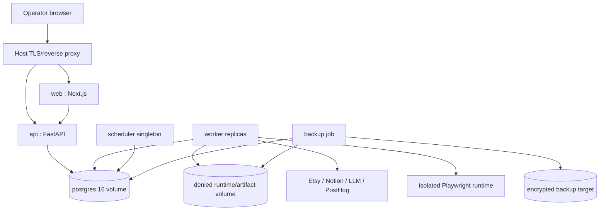

# Deployment

**Contract status:** target local and single-server topology. Current worker/scheduler are intentionally uncommissioned and exit 78; deployment is not complete evidence until later session gates pass.

## Topology

Local development and initial production use Docker Compose and the same five logical services. A host reverse proxy/TLS layer is production infrastructure, not another application service.

## Containers and process rules

| Service | Replicas | Startup/readiness contract | Persistent data |
|---|---:|---|---|
| `postgres` | 1 | PostgreSQL health plus authenticated TCP query | database volume |
| `api` | 1+ | migrations complete; API-specific readiness | none |
| `worker` | 0+ until commissioned | database ready; registry/config valid; lease recovery active | runtime temp/artifacts through adapter |
| `scheduler` | exactly 1 initially | database ready; advisory singleton/trigger idempotency | none |
| `web` | 1+ | built application can reach configured API | none |

Worker horizontal scaling uses PostgreSQL claims. Scheduler duplication must still be safe through deterministic trigger keys, but production runs one instance initially.

## Environment and configuration

- Images are built from lockfiles with Python 3.12, Node 24/pnpm, and pinned browser/runtime dependencies.
- Secrets enter through deployment secret/environment mechanisms and are never baked into images or committed `.env` files.
- `APP_ENV` selects the runtime environment (`development` default, `test`, `production`). Development and test force simulation and external mutations false. Production requires the git-ignored `config/autonomy.yaml`; the tracked example file is refused as production authority.
- Production starts provider mode disabled/draft until explicit standing authority and commissioned adapters exist.
- UTC is used in containers/database; operator timezone is presentation/config metadata.
- The repository and runtime volumes remain distinct. Private source, browser profiles, receipts, customer/provider payloads, and generated evidence are denied Git content.

## Going live

The operator turns the machine on once, in one place, with no per-listing approval:

1. Copy `config/autonomy.example.yaml` to `config/autonomy.yaml`. The copy is git-ignored and is the only production standing authority.
2. In that file set `mode: live`, then the operation switches you actually authorize: `external_mutations_enabled`, `auto_publish`, `auto_deactivate`, `auto_multiply`, and any spend or message flags with their caps. `weekly_listing_cap` may not exceed fifteen.
3. In `config/publishing_ramp.yaml` set `publishing_enabled: true`. This is a second, tracked switch on purpose: it gates the ramp itself, so publication can be halted for the whole shop without editing standing authority.
4. Set `APP_ENV=production`. Any other value, including an empty one, keeps or forces simulation.
5. Start the services. Configuration is validated at load; contradictory or unbacked authority fails closed with a named error rather than running in a half-authorized state.

Nothing else is asked of the operator during normal running. The system stops only for the reasons listed in `AUTONOMY_MODEL.md`.

## Startup order

1. Validate non-secret configuration and autonomy contracts.
2. Start PostgreSQL and prove authenticated TCP readiness.
3. Apply forward migrations once under an exclusive migration contract.
4. Start API, then scheduler and commissioned workers.
5. Start web after its API endpoint is configured.
6. Verify narrow service readiness and queue/lease recovery.

A container being alive is not enough. Worker/scheduler exit 78 is an intentional unavailable signal until those processes are commissioned.

## Deployment and rollback

- Build immutable tagged images from a reviewed Git checkpoint.
- Run format, static, contract, transition, bootstrap, build, and required integration gates before promotion.
- Back up PostgreSQL and required artifact metadata/bytes before a migration that cannot be trivially reversed.
- Deploy schema-compatible code before destructive cleanup migrations.
- Roll back application images only when schema compatibility is proved; otherwise restore through the documented database procedure.
- Reconcile running/uncertain external jobs after restart rather than blindly retrying.

Release wrappers remain uncommissioned until they implement these checks. Exit 78 is not deployment success.

## Backup and restore contract

A backup records database snapshot identity, artifact-store snapshot/manifest identity, application/schema version, UTC time, encryption/target metadata, and verification result. Restore testing must prove workflow/jobs/events, idempotency records, lineage, listing versions, incidents, and artifact references agree. Browser profiles and credentials follow separate secret recovery and are not copied into ordinary backups or Git evidence.

## Security boundaries

- Expose only reverse-proxy web/API ports; PostgreSQL is private to the deployment network/host.
- Run containers as non-root where supported and use read-only filesystem layers plus explicit writable volumes.
- Browser execution is isolated with bounded network/provider scope.
- Provider authority is checked in application state, not inferred from network reachability.
- Logs and health payloads contain no secrets or private payloads.

## Scale and revisit

Increase worker count, database resources, or artifact storage independently based on measured demand. Do not introduce Kubernetes, Kafka, Redis, Temporal, multiple databases, or microservices without evidence that the approved topology cannot meet availability, throughput, isolation, or deployment requirements.