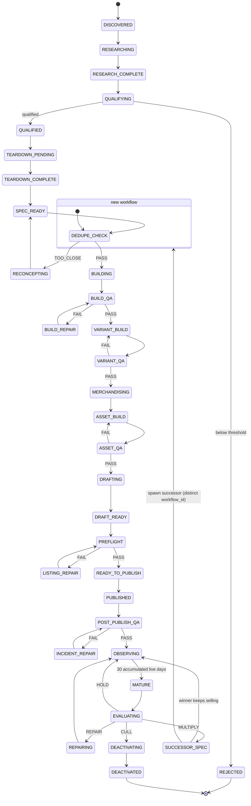
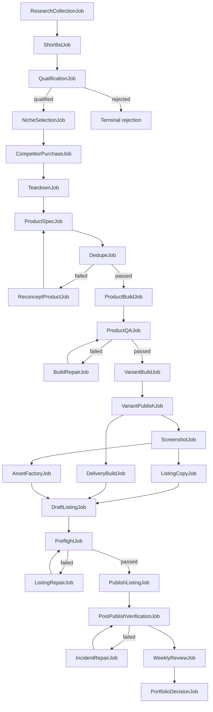
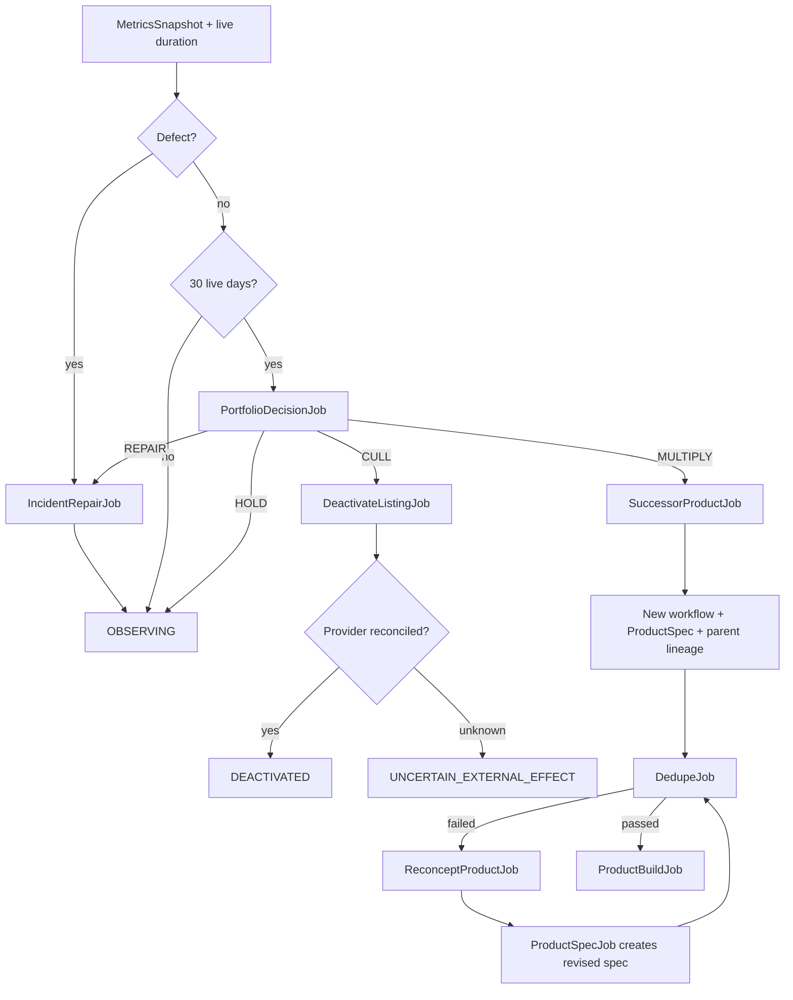

# State Machine

**Contract status:** Session 01 executable design. `ProductLifecycleState`, branch-result enums, and transition tables must match this document exactly.

## Product lifecycle



`REJECTED` is the terminal result for an unqualified candidate. `DEACTIVATED` is terminal for that listing version, not deletion of product lineage. Provider ambiguity is represented in job/agent-run status; it never invents a product lifecycle transition.

## Transition contract

- Only edges in the immutable transition table are valid.
- Branch results (`PASS`, `FAIL`, `TOO_CLOSE`) and portfolio decisions (`HOLD`, `REPAIR`, `CULL`, `MULTIPLY`) select edges; they are not product states.
- A transition records source state, target state, causing job, event, evidence references, and UTC time.
- No transition occurs until the causing job and its declared success contract commit.
- Failed or blocked agent runs leave product state unchanged unless an explicit failure edge exists.
- `RECONCEPTING` creates a new ProductSpec version in the same pre-build workflow.
- `SUCCESSOR_SPEC` creates a new ProductSpec and workflow identity with parent lineage; the winner returns to `OBSERVING`. The only same-workflow edge out of `SUCCESSOR_SPEC` is to `OBSERVING`; `require_successor_spawn` authorizes the cross-workflow entry of the successor at `DEDUPE_CHECK` and rejects a successor whose `workflow_id` equals the parent's.

## Core job dependency flow



## Cull and multiply closed loop



## Broken-link incident repair

```mermaid
sequenceDiagram
    participant Check as LinkVerificationJob
    participant DB as PostgreSQL
    participant Repair as A16 Repair Agent
    participant Owner as A07/A08/A13 effect owner
    participant Provider as Provider adapter
    participant QA as LinkVerificationJob / PreflightJob

    Check->>DB: persist BROKEN_LINK_DETECTED and incident
    DB->>Repair: unlock IncidentRepairJob
    Repair->>Provider: read/reconcile current link state
    Repair->>DB: persist diagnosis and replacement artifact if required
    Repair->>DB: create incident-scoped NotionRepairJob or ListingRepairJob
    DB->>Owner: unlock job for the exclusive mutation owner
    alt effect is safe and authorized
        Owner->>Provider: replace source link/file using idempotency key
        Owner->>DB: persist new artifact/listing version and effect receipt; emit REPAIR_APPLIED
        DB->>QA: create verification successor
        QA->>Provider: fresh-view and click verification
        QA->>DB: emit REPAIR_COMPLETED; close incident
    else credentials/challenge/uncertain effect
        Owner->>DB: BLOCKED or UNCERTAIN_EXTERNAL_EFFECT
        DB-->>Owner: resume only after holder action or reconciliation
    end
```

## Terminal guarantees

| Branch | Required durable result | Successor |
|---|---|---|
| Qualification rejection | Score and cited rejection | none for candidate |
| Dedupe failure | `DedupeResult` with collisions | `ReconceptProductJob` |
| QA/preflight failure | Structured defects | matching repair job |
| `HOLD` | `PortfolioDecision` | next scheduled review |
| `REPAIR` | `PortfolioDecision` and incident/defects | repair then observation |
| `CULL` | `PortfolioDecision` and reconciliation evidence | deactivation |
| `MULTIPLY` | `PortfolioDecision`, parent lineage, successor spec | new workflow at dedupe |
| Uncertain external effect | effect reference and reconciliation requirement | no ordinary retry |