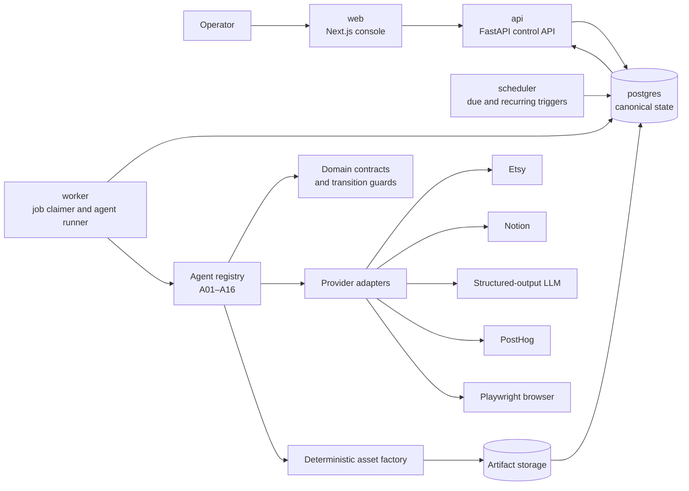

# System Overview

**Contract status:** Session 01 target architecture. Only the existing control utility and health surfaces are currently commissioned; worker and scheduler continue to fail closed with exit 78 until later sessions implement durable orchestration.

## Service architecture

## Deployable services

| Service | Responsibility | Must not become |
|---|---|---|
| `api` | Typed operator queries/commands, readiness, incident and workflow views | A job executor or source of hidden state |
| `worker` | Claim durable jobs, invoke one registered agent, persist result/evidence/events | An in-memory queue |
| `scheduler` | Create due, weekly, monthly, maturity, and recovery jobs idempotently | A long-running workflow owner |
| `web` | Compact current-work and exception console | Workflow authority or health proof for other services |
| `postgres` | Canonical business, workflow, event, lease, idempotency, and lineage state | A cache behind another queue |

All Python capabilities live in one modular monolith. The sixteen agents are registry entries executed by workers, not independent services. Scale is achieved first by adding identical workers, not splitting repositories.

## Internal module boundaries

| Package | Owns | May depend on |
|---|---|---|
| `domain` | Enums, value objects, lifecycle transitions, business result models | Pydantic and standard library |
| `agents` | Versioned input/output contracts and agent implementations | `domain`, provider interfaces |
| `orchestration` | Claims, dependencies, leases, retries, events, successors | `domain`, persistence interfaces, agent registry |
| `persistence` | SQLAlchemy mappings, repositories, unit of work | `domain`, orchestration ports |
| `integrations` | Etsy, Notion, LLM, PostHog, browser, storage adapters | Provider SDKs and domain-facing interfaces |
| `assets` | Deterministic render manifests and output factory | Domain facts, browser renderer, storage interface |
| `config` | Strict settings and autonomy/product policies | Domain enums and Pydantic |
| `api` | Typed HTTP schemas and operator commands | Application services, never provider SDKs directly |

`money-machine-control` is a separate repository-continuity utility. It does not share or replace product lifecycle state.

## Execution path

1. Scheduler or a successful predecessor creates/unlocks a durable job.
2. PostgreSQL constraints and dependencies determine eligibility.
3. A worker claims one job with `FOR UPDATE SKIP LOCKED` and a lease.
4. The registered agent receives a strict `JobEnvelope`.
5. Domain logic and an admitted adapter produce a strict `AgentResult`.
6. One transaction persists result, evidence/artifact links, domain events, dependency release, and deterministic successors.
7. External effects occur outside the transaction using idempotency keys. Ambiguous outcomes become `UNCERTAIN_EXTERNAL_EFFECT` and reconcile before retry.
8. API/web read the resulting state; they do not infer completion from logs.

## System invariants

- Every playbook step has an owner, job, persisted output, event, and successor or declared terminal result.
- No model response, telemetry event, log line, or web state replaces durable workflow evidence.
- Tests use simulation/fixture adapters and cannot publish, purchase, pay, deactivate, or message.
- Unknown provider capability and missing authority fail closed without blocking unrelated internal work.
- Every material artifact is immutable, hashed, and linked to exact inputs, producing run, QA result, and listing version.
- A mature `MULTIPLY` creates a new dedupe-gated workflow; `CULL` creates a separately authorized deactivation job.
- The public Git repository is not authority for any commercial or provider effect.